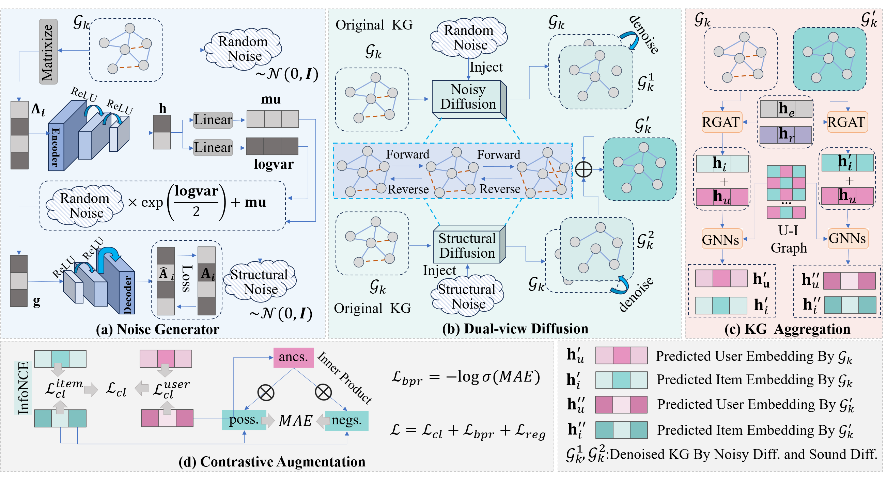
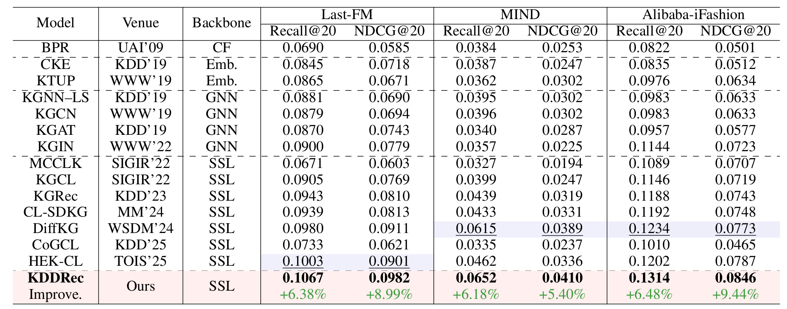

# KDDRec: Noisy or Structural? Knowledge Graph-based Dual-view Diffusion for Recommendation Systems

This repo provides the source code & data of our paper "Noisy or Structural? Knowledge Graph-based Dual-view Diffusion for
Recommendation Systems"(KDDRec)



[//]: # ()

In this paper, we introduce the KDDRec, which investigates the excessive denoising problem of knowledge graph diffusion denoising and employs dual-view diffusion for knowledge graph to mitigate this issue. In addition, we introduce a noise generating mechanism that leverage Variational Autoencoder to generate VAE noise to compensate for the structural limitations of traditional random noise and perturbing the original data from different perspectives.After extensive experiments on three datasets, our model achieves state-of-the-art performance in recommendation, outperforms current recommender methods.
##  1. Dependencies

- python==3.9.13
- numpy==1.23.1
- torch==1.11.0
- scipy==1.9.1
- pip install --no-index torch-scatter -f https://data.pyg.org/whl/torch-1.11.0+cu113.html

##  2. Datasets

| Statistics          | Last-FM         | MIND            | Alibaba-iFashion |
| ------------------- | --------------- | --------------- | ---------------- |
| # Users             | 23,566          | 100,000         | 114,737          |
| # Items             | 48,123          | 30,577          | 30,040           |
| # Interactions      | 3,034,796       | 2,975,319       | 1,781,093        |
| # Density           | 2.7 × $10^{-3}$ | 9.7 × $10^{-4}$ | 5.2 × $10^{-4}$  |
| **Knowledge Graph** |                 |                 |                  |
| # Entities          | 58,266          | 24,733          | 59,156           |
| # Relations         | 9               | 512             | 51               |
| # Triplets          | 464,567         | 148,568         | 279,155          |

##  3. Run the codes

Run KDDRec by ``` !bash run.sh``` with the default dataset as mind. Specific dataset selection can be modified in run.sh.


##  4. Code Structure

```
.
├── README.md
├── KDDRec.png
├── performance.png
├── MultiviewDiff.py
├── VAE.py
├── Main.py
├── Model.py
├── Params.py
├── DataHandler.py
├── Utils
│   ├── TimeLogger.py
│   └── Utils.py
└── Datasets
    ├── alibaba
    │   ├── trnMat.pkl
    │   ├── tstMat.pkl
    │   └── kg.txt
    ├── lastFM
    │   ├── trnMat.pkl
    │   ├── tstMat.pkl
    │   └── kg.txt
    └── mind
        ├── trnMat.pkl
        ├── tstMat.pkl
        └── kg.txt
```

##  5. Experimental Results

Performance comparison of baselines on different datasets in terms of Recall@20 and NDCG@20:


Performance comparison of different recommendation models. The optimal results are highlighted in **bold**, while the second-best results are <u>underlined</u>


[//]: # (Many thanks to the authors and developers!)


